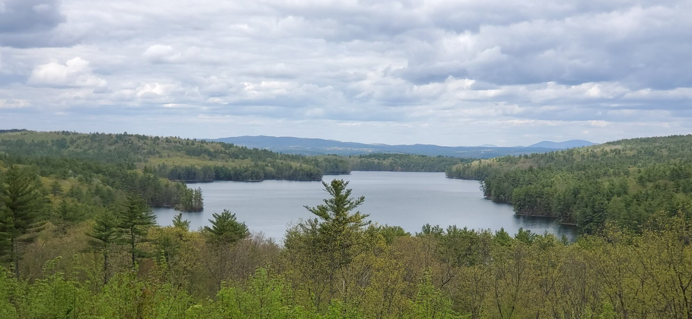

## Hi there 👋 and Welcome to My GitHub Repo

<!--
**glnnlhmn/glnnlhmn** is a ✨ _special_ ✨ repository because its `README.md` (this file) appears on your GitHub profile.

Here are some ideas to get you started:

- 🔭 I’m currently working on ...
- 🌱 I’m currently learning ...
- 👯 I’m looking to collaborate on ...
- 🤔 I’m looking for help with ...
- 💬 Ask me about ...
- 📫 How to reach me: ...
- 😄 Pronouns: ...
- ⚡ Fun fact: ...
-->

## [Repo Index](https://github.com/glnnlhmn/glnnlhmn/blob/main/INDEX.md)

## Me

Currently, I live in New Hampshire's Lake region (shown above). I was born in Harrisburg, Pa, but I tell people I am from [Hershey](https://www.hersheypa.com/). For some reason, more people know about chocolate than the capital of a state.  I left home to join the Navy after graduating from high school.  In the Navy, I volunteered for submarine duty. (Side note: I volunteered to serve on ships designed to sink. Please do not expect me to be to normal.)  During my time in the Navy, I was married to a great woman and had four children. After about 20 years in the Navy, I had to get a real job. My children have since blessed me with four grandchildren.  

## Data

The concept of turing data into useful information is something I find interesting. As such since about 1985, I have been discovering really interesting things for sometime. I will not bore you with the details associated with years of projects and discovery. If you are interested in that type of information you can check out [my LinkedIn profile](https://www.linkedin.com/in/glenndlehman/).

## Organizations

I have belonged to lots over the years. Currently I am active with [Boston Python](https://about.bostonpython.com/).

## Education

I am currently attedning Southern New Hapshire University where I carry a dual major of Mathematics amd Computer Science (w/Focus on Data Analytics) I started keepng my computer science work in my [SNHU Repo](https://github.com/glnnlhmn/SNHU) if you ae interested in my projects.
